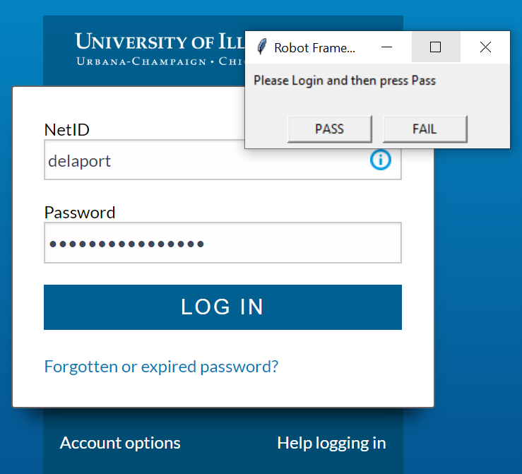
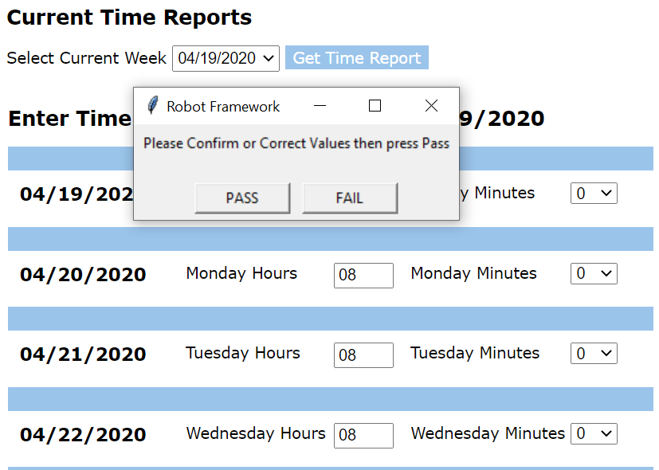

## About

This repository contains a single file `ReportTime.robot` which contains examples of concepts needed to do many web application verification steps in RobotFramework.

The purpose of RobotFramework is to speed up verification that important functionality remains intact when upgrading web applications and web application servers.

Using RobotFramework can increase the assurance, availability, reliability and patch frequency of web application systems by increasing confidence in the reliability and testability of software releases, allowing a faster and more trusted software update cycle.

The purpose of this example script is to help familiarize maintainers of web application servers with the capabilities available for through the free and open source tool, RobotFramework. 

The process this script directly assists with is correctly and quickly filling in Positive Time Report forms for State of Illinois employees.

## Manual Steps

This script will not login for you, or set your exact time values. The script will pause for user input at those two steps, as shown below.

1. Pause to login.


2. Pause to correct any incorrect default values.



## Setup

Robotframework is cross platform, but these installation instructions are Windows-specific.

Install steps on Apple/Macintosh or Linux should actually be slightly simpler, but I do not want to publish them without testing them. A pull request to add Apple or Linux install instructions would be welcomed. 

Requirements:
  - Python3 (be sure to include tk / tkinter library)
  - chromedriver
  - RobotFramework
  - robotframework-seleniumlibrary

Install steps:
  - Install [Python3](https://www.python.org/downloads/windows/) using the Python installer. ***Be sure to include tk / tkinter in the install options.***
  - Install [Chocolatey](https://chocolatey.org/install)
  - Run the following steps to use Pip and Chocolatey to install the remaining requirements.

Once you have Python3 and Chocolatey installed, you can install the rest using the following commands.

Run these commands as **Administrator**:

```powershell
pip install robotframework
pip install wheel
pip install --upgrade robotframework-seleniumlibrary
choco install chromedriver
```

## Running the Robotframewok script

Run the command like so:
```powershell
robot .\ReportTime.robot
```

If you see this message:
> SessionNotCreatedException: Message: session not created: This version of ChromeDriver only supports Chrome version XX

Run this command as administrator:

```powershell
choco upgrade chromedriver
```

## Using the tool

- The browser will pause on the login page.
- A small pop-up will appear, asking you to press 'Pass' to resume the script once you are logged in.
- You will be prompted to verify each week of data. 40 hours will be pre-filled. Make any changes and then press 'Pass' again.
- The script will continue to prompt you until your overdue time reports have been verified and submitted.
- Abort at any time by closing the browser window.
- The PTR application and this script will automatically pick up where you left off next time you visit.
- The browser window will close automatically once you are caught up.

## Command line output

The output of a successful run looks a bit like this:

```powershell
==============================================================================
ReportTime :: Assists users in quickly filling out and verifying their PTR ...
==============================================================================
User gets PTR up to date by filling in any cards
------------------------------------------------------------------------------
1 critical test, 1 passed, 0 failed
1 test total, 1 passed, 0 failed
==============================================================================
Output:  C:\src\RobotFramework\output.xml
Report:  C:\src\RobotFramework\report.html
```